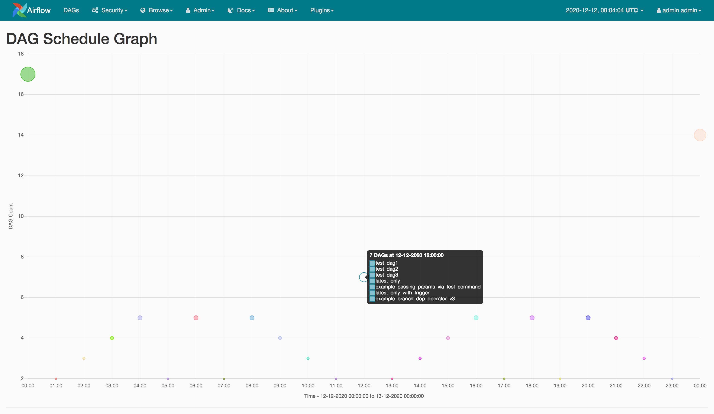

# DAG Schedule Graph

Airflow plugin for visualising DAG schedules within 24 hour window of a day.

> Note: Project is in its early development stage so bugs are expected.



## Install

```shell
pip install dag-schedule-graph
```

## Trying it out using Docker

```shell
# Start the services
docker-compose up

# Access the webserver
open http://localhost:8082/dag-schedule-graph/

# Cleanup containers, networks and volumes
docker-compose down -v
```

## Development

```shell
# Create virtual environment using conda  
conda create -n dag-schedule-graph python=3.7.9

# Activate the environment
conda activate dag-schedule-graph

# Load environemnt variables
source .env

# Create Postgres database and user
createuser airflow_rbac
createdb -O airflow_rbac airflow_rbac

# Install plugin and all dependencies
pip install -e '.[dev]'

# Running tests
pytest tests

# Initialize Airflow
airflow initdb

# Create Airflow user 
airflow create_user -u admin -e admin@gmail.com -p admin -f admin -l admin -r Admin

# Build static assets
npm run build

# Start Airflow Webserver
airflow webserver

# Access webserver
open http://localhost:8080/dag-schedule-graph/
```
